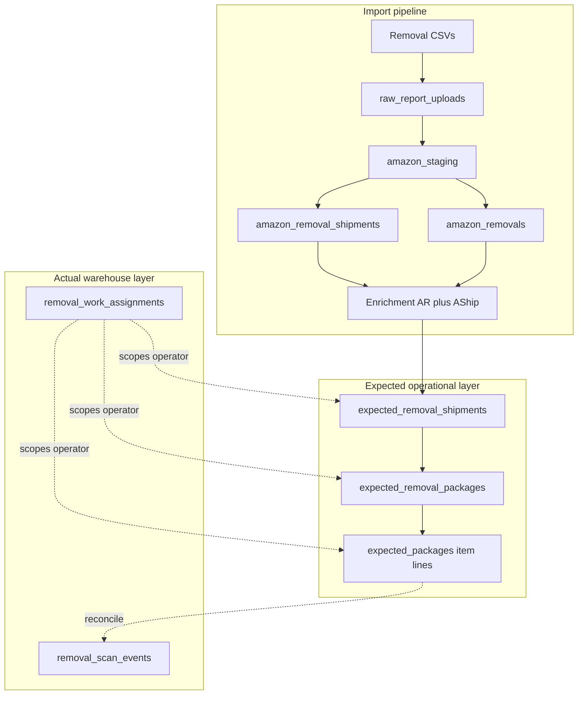

# Full removal import + warehouse scanning pipeline (plan only)

## Pipeline overview (import → worklist → warehouse)

**Current code anchors (import Phases 1–4):**

- Removal Order → `amazon_removals`: [`app/api/settings/imports/sync/route.ts`](app/api/settings/imports/sync/route.ts), [`lib/import-sync-mappers.ts`](lib/import-sync-mappers.ts), [`backend-python/main.py`](backend-python/main.py) (`_run_sync_removals`).
- Removal Shipment → archive + enrichment: [`app/api/settings/imports/sync/route.ts`](app/api/settings/imports/sync/route.ts) (`runRemovalShipmentSync`), [`backend-python/main.py`](backend-python/main.py).
- Worklist → `expected_packages` today: [`backend-python/main.py`](backend-python/main.py) (`_generate_worklist_core`), [`app/api/settings/imports/generate-worklist/route.ts`](app/api/settings/imports/generate-worklist/route.ts).
- Shipments DDL: [`supabase/migrations/20260513_amazon_removal_shipments.sql`](supabase/migrations/20260513_amazon_removal_shipments.sql).
- Staging uniqueness: [`supabase/migrations/20260519_amazon_removals_one_row_per_staging_line.sql`](supabase/migrations/20260519_amazon_removals_one_row_per_staging_line.sql), [`supabase/migrations/20260520_removals_staging_unique_for_postgrest.sql`](supabase/migrations/20260520_removals_staging_unique_for_postgrest.sql).

---

## Schema layering (explicit separation)

| Layer | Purpose | Tables (existing → proposed) |
|-------|---------|----------------------------------|
| **Raw import** | Upload sessions, audit, staging blobs | `raw_report_uploads`, `raw_report_import_audit`, `amazon_staging` |
| **Normalized Amazon** | Idempotent domain truth from CSVs + dual-layer keys | `amazon_removals`, `amazon_removal_shipments` (+ migrations for `store_id`, typed cols, uniques) |
| **Expected operational** | What the warehouse should process (tree: shipment → box → item) | **Existing:** `expected_packages` (evolve). **New:** `expected_removal_shipments`, `expected_removal_packages` (see below). |
| **Actual execution** | Operator scans; never overwrites expected rows in place | **New:** `removal_scan_events` (minimum v1); optional later `removal_scan_sessions`. |
| **Assignment / visibility** | Who may see which subtree | **New:** `removal_work_assignments`; use `profiles.role` + `profiles.team_groups` + RLS. |

---

## A) `amazon_removals` (requirements)

| Requirement | Plan direction |
|-------------|----------------|
| Upload-level idempotency | Non-partial unique on `(organization_id, upload_id, source_staging_id)` (PostgREST-safe). |
| Business-level uniqueness | Second unique index on business line + **`store_id`** (mandatory after rollout). Validate columns against real CSVs; `NULLS NOT DISTINCT` where needed. |
| Mandatory `store_id` | NOT NULL + FK to `stores`; from Imports Target Store. |
| Shipment fields enrichable | `tracking_number`, `carrier`, `shipment_date`, etc. via enrichment rules — not sole identity. |

---

## B) `amazon_removal_shipments` (requirements)

- **Upload-level:** unique `(organization_id, upload_id, amazon_staging_id)` for idempotent archive.
- **Business-level:** unique tuple on typed columns + `store_id` + discriminator when needed; **`raw_row` always preserved**.
- **Multiple lines per order:** allowed; key must distinguish distinct physical lines.

---

## C) Enrichment: shipments → removals

Same conservative strategy as prior plan: store scope, NULL-tracking FIFO by line key, tracked fallback, non-destructive updates, conflict logs, row-count reconciliation.

---

## D) `expected_packages` (requirements) — item-level anchor

- **Role in the tree:** **`expected_packages` holds expected item-level rows** (Return lines: SKU / quantity / disposition / link back to removal business identity). This matches today’s “one worklist row per Return line” with dual-layer dedupe + `store_id`.
- **Hierarchy:** Add nullable **`parent_expected_package_id`** as a short-term bridge **or** (cleaner) FK **`expected_removal_package_id`** → new package table (preferred) so item rows hang under a **package/box** node.
- **Regeneration:** Amazon-only columns merged; **do not** store live scan state on these rows (see Actual layer).

---

## E) Expected tree — shipment → package → item

**Data sources for building the tree:** derived from **`amazon_removals`** + **`amazon_removal_shipments`** + **enrichment** (tracking, carrier, dates), scoped by **`organization_id`** + **`store_id`**.

| Level | What it represents | Table (plan) |
|-------|---------------------|--------------|
| **Shipment / tracking** | One node per distinct shipment identity (primarily **`tracking_number`** within org+store, plus carrier/date as attributes) | **New: `expected_removal_shipments`** — id, `organization_id`, `store_id`, `tracking_number`, `carrier`, `shipment_date`, optional `removal_order_id` / link to source `amazon_removals` / normalized shipment row, `metadata` jsonb for grouping keys. |
| **Package / box** | Physical container under a shipment: label, slip, inner reference | **New: `expected_removal_packages`** — id, `organization_id`, `store_id`, **`parent_expected_shipment_id`** FK, optional **`slip_barcode`**, **`box_reference`** / paper-inside-box id, `sort_index`. |
| **Item line** | SKU-level expected quantity for Returns | **Existing: `expected_packages`** — add FK **`expected_removal_package_id`** (nullable for v1 migration of flat rows) or require synthetic default package per shipment until data supports boxes. |

**Hierarchical grouping (future-proof):**

- `expected_removal_shipments` → 1:N `expected_removal_packages` → 1:N `expected_packages` (items).
- If v1 has **no** discrete box in Amazon data, create **one synthetic package row** per shipment so items always have a parent without inventing box-level truth.

**Build job:** Extend or follow **Generate Worklist** so it materializes/upserts shipment + package nodes then item lines (idempotent on business keys), instead of only flat `expected_packages`.

---

## F) Actual scan layer (separate from expected)

**Principle:** Operator scans live in **append-only (or insert + soft corrections)** tables. **Do not** overwrite expected rows to record scans.

**Minimum v1 table: `removal_scan_events`**

| Column (proposed) | Notes |
|-------------------|--------|
| `id` uuid PK | |
| `organization_id`, `store_id` | Tenant + store scope |
| `operator_user_id` | `auth.users` / `profiles` FK |
| `scan_kind` | e.g. `pallet`, `package`, `item`, `tracking`, `slip` |
| `raw_scan_value` | string scanned |
| `normalized_value` | optional normalized tracking / barcode |
| `matched_expected_shipment_id` | nullable FK → `expected_removal_shipments` |
| `matched_expected_package_id` | nullable FK → `expected_removal_packages` |
| `matched_expected_package_row_id` | nullable FK → `expected_packages` (item) |
| `match_status` | `matched` \| `orphan` \| `ambiguous` \| `rejected` |
| `quantity` | default 1 for item scans if applicable |
| `client_context` | jsonb (device, session id) |
| `created_at` | |

**Progressive tree fill:** Each scan **adds** facts; rollup views/materialized queries compute counts. **Corrections** = new event type or `void_of_event_id` (later), not DELETE of history.

---

## G) Expected vs actual — reconciliation (green / yellow / red)

**Definitions (live and at closeout):**

| Color | Meaning |
|-------|---------|
| **Green** | Expected entity (item/package/shipment node) has **satisfying** scan evidence by rule (e.g. item line: scanned qty ≥ expected qty for that line; package: all child items green or package-level scan policy met). |
| **Red** | Expected entity **still missing** required scan evidence **at closeout** (or at current filter for “not yet received”). |
| **Yellow** | **Orphan / extra:** `removal_scan_events` with `match_status = orphan` (or no FK to expected), or ambiguous match pending operator confirmation. |

**Confirmation rule:** Yellow scans **require explicit operator confirmation** before counting as green or before dismissing (configurable): e.g. “accept as extra” vs “link to expected” — store decision in `client_context` or a small `removal_scan_decisions` table (phase 2).

### Counts — how computed

**a) Item level**

- **Expected count:** `expected_packages.expected_quantity` (or shipped/requested fields as defined for Returns).
- **Actual count:** Sum of **`removal_scan_events`** matched to that **`expected_packages.id`** (and optionally only `match_status = matched` after confirmation).
- **Green:** actual ≥ expected (or equality policy per org).
- **Red:** actual < expected at closeout.

**b) Package level**

- **Expected:** set of item lines under `expected_removal_packages.id` **or** policy “package green if tracking+slip scan present”.
- **Actual:** aggregate of child item scan counts **or** dedicated package-level scans linked to `expected_removal_packages.id`.
- **Green:** all children green **or** package-level rule satisfied.
- **Red:** any child red at closeout (or package required scan missing).

**c) Pallet level**

- **Expected:** pallet node (see hierarchy) — **new optional `expected_removal_pallets`** or **`parent` on package** pointing to pallet; if pallets not in Amazon feed, **admin-created** pallet records only in operational layer.
- **Actual:** scans with `scan_kind = pallet` linked to pallet id **or** roll up from packages on pallet.
- **Green / red / yellow:** same rollup from children + orphan pallet scans (yellow).

**Implementation note:** expose reconciliation via **SQL views** or **server computed DTOs** (e.g. `v_removal_reconciliation_item`, `..._package`, `..._pallet`) so UI and APIs stay consistent.

---

## H) Operator visibility and assignment

**Current role model** ([`20260417_profiles_team_groups_5tier_rbac.sql`](supabase/migrations/20260417_profiles_team_groups_5tier_rbac.sql)):

- Roles: `super_admin`, `system_employee`, `admin`, `employee`, `operator` (ordered high → low).
- `team_groups` JSONB on `profiles` for future GBAC.

**Visibility rules (plan):**

| Role | Removal scan / expected data visibility |
|------|----------------------------------------|
| `operator` | **Only** rows tied to an **active assignment** (`removal_work_assignments`) for that user (or their pool) — subtree rooted at assigned **pallet**, **package**, or **shipment** id. **No** org-wide browse. |
| `employee` | Typically **store-scoped** or **assignment-scoped** (product decision); broader than operator if business requires. |
| `admin` | **Org-wide** (and store-filtered) expected + actual + reconciliation dashboards; manage assignments. |
| `system_employee` / `super_admin` | Cross-org or full diagnostics per product policy; break-glass assignment override. |

**Minimum v1 schema: `removal_work_assignments`**

| Column (proposed) | Notes |
|-------------------|--------|
| `id` uuid PK | |
| `organization_id`, `store_id` | |
| `assignee_user_id` | operator |
| `scope_type` | `pallet` \| `expected_shipment` \| `expected_package` \| `subtree` |
| `scope_root_id` | uuid (polymorphic — type in scope_type) |
| `status` | `active` \| `completed` \| `revoked` |
| `assigned_by_user_id`, `created_at`, `expires_at` | |

**Enforcement:** RLS policies: operators **`SELECT`** only where `exists (assignment matching row’s subtree)`; inserts to `removal_scan_events` only if assignment covers target. **Admins** bypass via role check in policies or service role for admin UI.

---

## I) Tree / hierarchy model (v1)

- **Pallet:** optional `expected_removal_pallets` (id, label, store_id) **or** reuse existing returns `pallets` only if product links removal workflow to same pallet entity — **decision point:** separate removal pallets vs shared `pallets` table.
- **Package/box:** `expected_removal_packages` with `parent_pallet_id` nullable.
- **Item:** `expected_packages` with `expected_removal_package_id`.
- **Tracking number:** on `expected_removal_shipments` and duplicated on package for fast scan lookup (indexed).
- **Slip / packing slip / slip barcode:** `expected_removal_packages.slip_barcode` + optional `paper_reference` text.
- **Parent-child:** FKs as above; **no** cycles.
- **Progressive completion:** derived from reconciliation views + optional `completion_percent` cached on shipment/package (phase 2).

---

## J) Scanner flow (future-safe, not v1 implementation)

1. Operator scans **pallet** or **package** or **tracking** — server resolves **subtree** (assignment-checked).
2. Load **only** assigned subtree: expected nodes + prior scans for that subtree.
3. Show **expected vs actual** counts at item level (rollup to package/pallet).
4. **Yellow:** orphan or ambiguous — **require confirmation** dialog before committing match or marking extra.
5. **Red:** missing expected items remain visible on **closeout** screen.
6. **Final close / complete:** admin or privileged role marks **session or shipment** complete; freeze reconciliation snapshot (optional `removal_closeout_snapshots` table later).

---

## K) Raw / normalized / expected / actual / assignment — table list

**Exact tables involved**

- **Raw import:** `raw_report_uploads`, `amazon_staging`, `raw_report_import_audit`.
- **Normalized Amazon:** `amazon_removals`, `amazon_removal_shipments`, `stores`, `profiles` (context).
- **Expected operational:** `expected_packages` (items); **new** `expected_removal_shipments`, `expected_removal_packages`; **optional** `expected_removal_pallets`.
- **Actual:** `removal_scan_events` (v1); optional later `removal_scan_sessions`, `removal_scan_decisions`.
- **Assignment:** `removal_work_assignments`.

**Proposed new columns (existing tables)**

- `amazon_removals.store_id`, business unique index; keep staging unique.
- `amazon_removal_shipments.store_id`, typed columns, dual uniques.
- `expected_packages.store_id`, `expected_removal_package_id` FK, business + staging uniques preserved.
- `expected_removal_shipments` / `expected_removal_packages`: as in section E.

---

## L) Role visibility summary

- **Operators:** assignment-scoped queries only; cannot list full org expected inventory.
- **Admins / super_admin:** full org (and cross-org for super) visibility for monitoring, assignment creation, closeout.
- **RLS + server routes** must enforce the same rules (never rely on client filtering alone).

---

## M) Reconciliation logic summary

- Three-state **per node** (item / package / pallet): green, yellow, red driven by **expected quantities vs matched scan events** and **orphan scans**.
- Rollups: item → package → pallet; yellow at child may bubble to parent per policy.
- **Closeout:** red = expected not satisfied; yellow list for review; snapshot optional.

---

## N) Files likely to change (when implementing)

- Migrations: [`supabase/migrations/`](supabase/migrations/).
- Metadata / store: [`lib/raw-report-upload-metadata.ts`](lib/raw-report-upload-metadata.ts), [`app/(admin)/imports/import-actions.ts`](app/(admin)/imports/import-actions.ts).
- Sync / worklist: [`app/api/settings/imports/sync/route.ts`](app/api/settings/imports/sync/route.ts), [`backend-python/main.py`](backend-python/main.py), [`app/api/settings/imports/generate-worklist/route.ts`](app/api/settings/imports/generate-worklist/route.ts).
- **New:** API routes for scans, assignments, reconciliation views; RLS policy files or SQL migrations.

---

## O) Proposed migrations (shape, extended)

1. Amazon tables: `store_id`, dual uniques, shipment typed columns (prior plan).
2. **Expected tree:** create `expected_removal_shipments`, `expected_removal_packages`; alter `expected_packages` with FKs.
3. **Actual:** create `removal_scan_events` + indexes on `(organization_id, store_id, normalized_value)`, FKs to expected tables.
4. **Assignment:** create `removal_work_assignments` + RLS.
5. **Views:** reconciliation views for item/package/pallet.
6. `NOTIFY pgrst, 'reload schema'`.

---

## P) Diagnostic / cleanup SQL (unchanged core)

- Duplicate detection on staging and business keys for all Amazon + expected tables.
- Cleanup before `CREATE UNIQUE INDEX`; backup first.

---

## Q) Performance and scaling

- Index foreign keys used for subtree loads: `parent_*`, `tracking_number`, `store_id`, `assignee_user_id`.
- Partitioning `removal_scan_events` by month (later) if volume grows.

---

## R) Test plan (extended)

1. Import tests (prior plan).
2. **Tree build:** Generate Worklist produces shipment → package → item; synthetic package when no box data.
3. **Scans:** Insert scan events; expected rows unchanged; reconciliation view matches green/red/yellow.
4. **Operator:** RLS denies cross-assignment read; admin sees all.
5. **Closeout:** reds and yellows match spec.

---

## Open decisions (before coding)

1. **Business keys** for Amazon tables (CSV validation).
2. **Pallet entity:** new removal-specific pallet table vs reuse [`pallets`](supabase/migrations) from returns module.
3. **Employee** vs **operator** visibility (store-wide vs assignment-only).
4. Whether **v1** ships **flat** `expected_packages` + scan events only, with tree tables in **v1.1** (phased rollout).

---

*Plan only — no code or migrations implemented until explicitly approved.*
